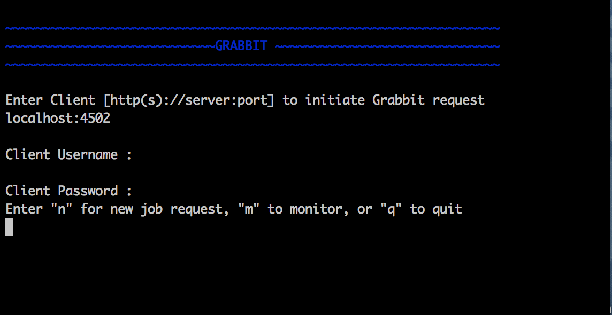
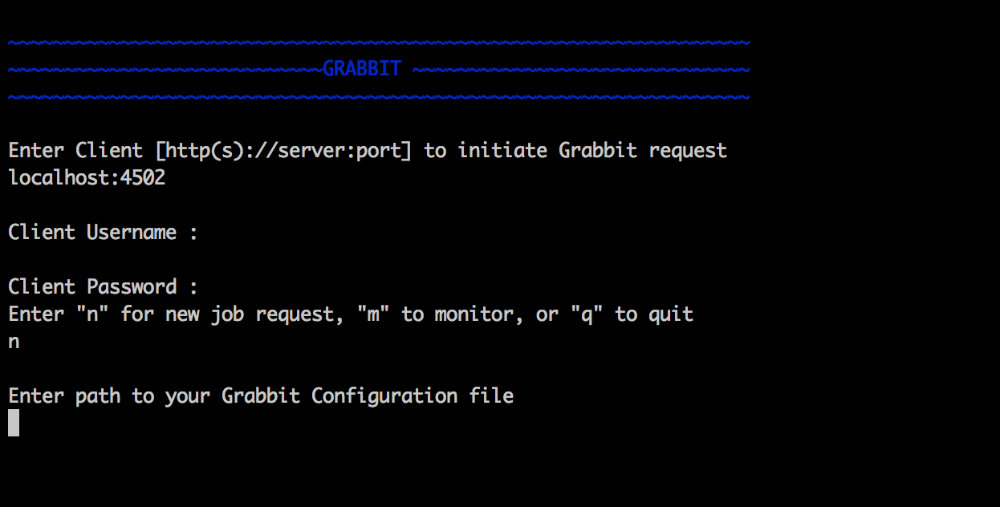
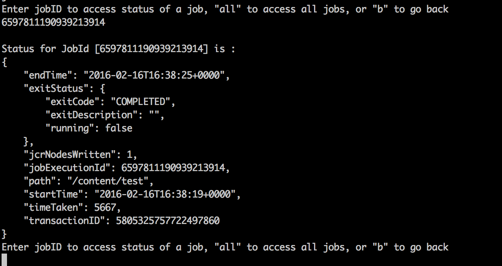

[](https://travis-ci.org/TWCable/grabbit) [](https://waffle.io/TWCable/grabbit) 

[  ](https://bintray.com/twcable/aem/Grabbit/_latestVersion)

# Purpose #

The purpose of Grabbit is to provide a fast and reliable way of copying content from one Sling (specifically Adobe CQ/AEM) instance to another.

Existing solutions have been tried and found insufficient for very large data sets (GB-TB), especially over a network. CQ's .zip packages are extremely space inefficient, causing a lot of extra I/O. [`vlt rcp`](http://jackrabbit.apache.org/filevault/usage.html) and Mark Adamcin's [`recap`](http://adamcin.net/net.adamcin.recap/) use essentially the same mechanism: WebDAV using XML, doing an HTTP handshake for every node and many sets of properties, which means that any latency whatsoever on the network hurts performance enormously.
 
Grabbit creates a stream of data using [Google's Protocol Buffers](https://developers.google.com/protocol-buffers/) aka "ProtoBuf". Protocol Buffers are an extremely efficient (in terms of CPU, memory and wire size) binary protocol that includes compression. 

Moreover, by doing a continuous stream, we avoid the latency issues. Depending on the size and nature of the data, as well as network latency, we have so far seen speed improvements ranging from 2 to 10 times that of Recap/vlt. 

*__"Grabbit"__ obviously refers to this "grabbing" content from one CQ instance and copying it to another. However it also refers to "Jackrabbit," the reference JCR implementation that the content is being copied to and from.*
 
# AEM Support

Below details AEM version support for the various releases of Grabbit.  
```
v5.x - AEM 6.1
v4.x - AEM 6.1
v3.x - CQ 5.6 and AEM 6.0
v2.x - CQ 5.6
```

Active development is on the "master" branch, which is currently the 5.x version line. Security patches and the like are sometimes back-ported to prior versions.

Of course pull-requests are happily accepted for those that would like to submit things like back-porting features for AEM 5.6, etc.

# Runtime Dependencies

* AEM/CQ 
* To run Grabbit in your AEM/CQ instance, **you need to install a Fragment Bundle once per instance. It can be found [here](https://bintray.com/artifact/download/twcable/aem/dependencies/Sun-Misc-Fragment-Bundle-1.0.0.zip)**

# Building From Source #

## Full Clean Build & Install ##

`gradlew clean build install refreshAllBundles` 

## Pre-requisites ##

### Installing Protocol Buffers Compiler ###

#### For Windows ####

Install the binary from https://github.com/google/protobuf/releases/download/v2.4.1/protoc-2.4.1-win32.zip and then set the `/path/to/protoc/parent` on your PATH variable.

#### For Macs ####

```

brew tap homebrew/versions

brew install protobuf241

brew link --force --overwrite protobuf241

```

_For both Windows and Mac : To verify that installation was successful, `protoc --version` should display `2.4.1`_


# Running Grabbit #

[This] (grabbit.sh) shell script can be used to initiate new Grabbit jobs, or monitor existing jobs. 

##Getting Started With grabbit.sh

- Run grabbit.sh
- Enter connection details to your Grabbit "client" server (The server you wish to pull content into)
 
 
 
##Creating a New Job Request

From the main screen, enter "n" for a new request. Enter an absolute path (from the machine you are running grabbit.sh) to the Grabbit configuration file you wish to use for creating a new request.
See the "Configuration" section for details on how to create these configuration files. 

 
 
After the job request is sent, and started you should see a confirmation screen with the job IDs of all the jobs started, as well as their transaction ID

 
 
##Monitoring

From the main screen, enter "m" to monitor an existing job, or jobs. You will be prompted. If you would like to monitor a group of jobs by their transaction, enter "t". If you would like to monitor a specific jobs, enter "j".
 
 
 
See "Monitoring / Validating the Content Sync" for information on evaluating the returned information.
 

### Configuration

Configuration can be developed in both YAML, and JSON formats.

Here is an example `JSON` configuration file that could be used for configuring Grabbit:

```json
{
    "serverUsername" : "<username>",
    "serverPassword" : "<password>",
    "serverHost" : "some.other.server",
    "serverPort" : "4502",
    "deltaContent" : true,
    "pathConfigurations" :  [
        {
            "path" : "/content/someContent",
        },
        {
            "path" : "/content/someContent",
            "excludePaths" :
            [
                "someOtherContent/someExcludeContent"
            ]
        },
        {
            "path" : "/content/dam/someDamContent",
            "excludePaths":
                [
                    "someContent/someExcludeContent",
                    "someContent/someOtherExcludeContent"
                ],
            "workflowConfigIds" :
                [
                    "/etc/workflow/launcher/config/update_asset_mod",
                    "/etc/workflow/launcher/config/update_asset_create",
                    "/etc/workflow/launcher/config/dam_xmp_nested_writeback",
                    "/etc/workflow/launcher/config/dam_xmp_writeback"
                ],
            "deltaContent" : false
        }
    ]
}
```
The corresponding YAML configuration for the JSON above will look something like:
```yaml
# Client Type: author

# Information for connecting to the source content
serverUsername : '<username>'
serverPassword : '<password>'
serverHost : some.other.server
serverPort : 4502

deltaContent : true # default for all the paths

# A reference to the standard set of workflow configuration ids that
# we want to turn off when working with DAM assets.
&damWorkflows:
  - /etc/workflow/launcher/config/update_asset_mod
  - /etc/workflow/launcher/config/update_asset_create
  - /etc/workflow/launcher/config/dam_xmp_nested_writeback
  - /etc/workflow/launcher/config/dam_xmp_writeback


# Each of the paths to include in the copy
pathConfigurations :
  -
    path : /content/someContent
  -
    path : /content/someOtherContent
    excludePaths: [ someExcludeContent ]
  -
    path : /content/dam/someDamContent
    excludePaths :
      - someContent/someExcludeContent
      - someContent/someOtherExcludeContent
    workflowConfigIds : *damWorkflows
```

#### Required fields

* __serverHost__: The server that the client should get its content from.
* __serverPort__: The port to connect to on the server that the client should use.
* __serverUsername__: The username the client should use to authenticate against the server.
* __serverPassword__: The password the client should use to authenticate against the server.
* __pathConfigurations__: The list of paths and their options to pull from the server.
    * __path__: The path to recursively grab content from.

#### Optional fields

* __deltaContent__: boolean, ```true``` syncs only 'delta' or changed content. Changed content is determined by comparing one of a number of date properties including jcr:lastModified, cq:lastModified, or jcr:created Date with the last successful Grabbit sync date. Nodes without any of previously mentioned date properties will always be synced even with deltaContent on, and if a node's data is changed without updating a date property (ie, from CRX/DE), the change will not be detected.  Most common throughput bottlenecks are usually handled by delta sync for cases such as large DAM trees; but if your case warrants a more fine tuned use of delta sync, you may consider adding mix:lastModified to nodes not usually considered for exclusion, such as extremely large unstructured trees. The deltaContent flag __only__ applies to changes made on the server - changes to the client environment will not be detected (and won't be overwritten if changes were made on the client's path but not on the server).

Under "path configurations"

* __excludePaths__: This allows excluding specific subpaths from what will be retrieved from the parent path. See more detail below.
* __workflowConfigIds__: Before the client retrieves content for the path from the server, it will make sure that the specified workflows are disabled. They will be re-enabled when all content specifying that workflow has finished copying. (Grabbit handles the situation of multiple paths specifying "overlapping" workflows.) This is particularly useful for areas like the DAM where a number of relatively expensive workflows will just "redo" what is already being copied.
* __deleteBeforeWrite__: Before the client retrieves content, should the workspace identified by the path be cleared?  When used in combination with _excludePaths_, nodes indicated by _excludePaths_ will not be deleted
* __deltaContent__: boolean. Individual path overwrite for the global deltaContent setting. Functionality is the same, but on a path-by-path basis, instead of applying to all path configurations. No matter what the global setting is, specifying this field will overwrite it. If not specified, the path will sync according to the global setting.

#### Exclude Paths

Exclude Paths allow the user to exclude a certain set of subpaths for a given path while grabbing content. They can only be __relative__ to the "path".

For example, let's say you have

```{ "path" : "/content/someContent" }```

and you would like to exclude ```/content/someContent/someOtherContent/pdfs```

Valid:

```
{
    "path" : "/content/someContent",
    "excludePaths" :
    [
        "someOtherContent/pdfs"
    ]
}
```

Invalid:

```
{
    "path" : "/content/someContent",
    "excludePaths" :
    [
        "/content/someContent/someOtherContent/pdfs",
        "/someOtherContent/pdfs",
        "./someOtherContent/pdfs"
    ]
}
```

# Monitoring / Validating the Content Sync #

You may choose to use grabbit.sh to monitor your sync, or you can validate/monitor your sync by going to the following URIs: 

`/grabbit/job/<jobId>`
`/grabbit/transaction/<transactionId>`

A job status has the following format : 

```json
 {
       "endTime": "Timestamp",
       "exitStatus": {
           "exitCode": "Code",
           "exitDescription": "",
           "running": "true/false"
       },
       "jcrNodesWritten": "#OfNodes",
       "jobExecutionId": "JobExecutionId",
       "path": "currentPath",
       "startTime": "TimeStamp",
       "timeTaken": "TimeInMilliSeconds",
       "transactionId": "transactionId"
   }
```

Couple of points worth noting here:
`"exitCode"` can have 4 states - `UNKNOWN`, `COMPLETED`, `FAILED`, or `VALIDATION_FAILED`. `UNKNOWN` means the job is still running. `COMPLETED` means that the job was completed successfully. `FAILED` means the job failed. `VALIDATION_FAILED` means the job was aborted due to client configuration; This could mean that although the configuration was valid, Grabbit refused to perform some work due to imminent introduction of unintended consequences.  
`"jcrNodesWritten"` : This indicates how many nodes are currently written (increments by 1000)
`"timeTaken"` : This will indicate the total time taken to complete content grab for `currentPath`

If `exitCode` returns as `UNKNOWN`, that means the job is still running and you should check for its status again.


__Sample of a real Grabbit Job status__



Two loggers are predefined for Grabbit. One for Grabbit Server and the other for Grabbit Client. 
They are [batch-server.log](grabbit/src/main/content/SLING-INF/content/apps/grabbit/config/org.apache.sling.commons.log.LogManager.factory.config-com.twcable.grabbit.server.batch.xml) and [batch-client.log](grabbit/src/main/content/SLING-INF/content/apps/grabbit/config/org.apache.sling.commons.log.LogManager.factory.config-com.twcable.grabbit.client.batch.xml) respectively.
These log files are for anything logged in **com.twcable.grabbit.server.batch** and **com.twcable.grabbit.client.batch** packages.

If you want to see what nodes are being written on the Grabbit Client, change the logging for `batch-client.log` above to `DEBUG` or `TRACE`.

# Cleaning Grabbit Job Repository

Over time, the [Grabbit Job Repository](grabbit/src/main/groovy/com/twcable/grabbit/spring/batch/repository) which is stored under `/var/grabbit` grows and without pruning the data that it is storing, the performance of the Grabbit Status API degrades slowly.
In order to manage that, there is a `Clean Repository` API available that allows you to delete any Grabbit job history that is older than `X` hours from the time the API was hit.

The usage is :

```
POST /grabbit/jobrepository/clean
Parameter: hours=X

where X is the number of hours.
```

This API will delete all the [JobInstances](grabbit/src/main/groovy/com/twcable/grabbit/spring/batch/repository/GrabbitJobInstanceDao.groovy), [JobExecutions](grabbit/src/main/groovy/com/twcable/grabbit/spring/batch/repository/GrabbitJobExecutionDao.groovy), [StepExecutions](grabbit/src/main/groovy/com/twcable/grabbit/spring/batch/repository/GrabbitStepExecutionDao.groovy) and [ExecutionContexts](grabbit/src/main/groovy/com/twcable/grabbit/spring/batch/repository/GrabbitExecutionContextDao.groovy) that were either `COMPLETED` or `FAILED` X hours ago from `now`. 


# General Layout

There are two primary components to Grabbit: a client and a server that run in the two CQ instances that you want to copy to and from (respectively). 

A recommended systems layout style is to have all content from a production publisher copied down to a staging "data warehouse" (DW) server to which all lower environments (beta, continuous integration, developer workstations, etc.) will connect. This way minimal load is placed on Production, and additional DW machines can be added to scale out if needed, each of which can grab from the "main" DW.
The client sends an HTTP GET request with a content path and "last grab time" to the server and receives a protobuf stream of all the content below it that has changed. The client's BasicAuth credentials are used to create the JCR Session, so the client can never see content they don't have explicit access to. There are a number of ways to tune how the client works, including specifying multiple focused paths, parallel or serial execution, JCR Session batch size (the number of nodes to cache before flushing to disk), etc.

# Releasing

For the Grabbit developers, [instructions for releasing a new version of Grabbit](docs/RELEASING.adoc).

# Library Attribution

* [Groovy v2.3.6](http://groovy.codehaus.org/Download)
* [Google Protocol Buffers v2.4.1](https://code.google.com/p/protobuf/downloads/list) - The compiler and runtime library is used for Serialization and De-serialization of Data
* [Spring Batch v2.2.7.RELEASE](http://docs.spring.io/spring-batch/2.2.x/downloads.html) - It is used on the server and client to read/write, marshal/unmarshall and send/receive the data to client in a controlled manner.
* [Jackalope v2.0.0](https://bintray.com/twcable/aem/jackalope/2.0.0/view) - Jackalope is used for testing
* [CQ Gradle Plugins v2.0.1](https://bintray.com/twcable/aem/cq-gradle-plugins/2.0.1/view) : They provide Gradle build support.
* [Gradle Protocol Buffers Plugin v0.9.1](http://search.maven.org/#artifactdetails%7Cws.antonov.gradle.plugins%7Cgradle-plugin-protobuf%7C0.9.1%7Cjar) - It provides easy integration of the ProtoBuf compiler with Gradle.

# LICENSE

Copyright 2015 Time Warner Cable, Inc.

Licensed under the Apache License, Version 2.0 (the "License"); you may not use this file except in compliance
with the License. You may obtain a copy of the License at

http://www.apache.org/licenses/LICENSE-2.0

Unless required by applicable law or agreed to in writing, software distributed under the License is distributed on
an "AS IS" BASIS, WITHOUT WARRANTIES OR CONDITIONS OF ANY KIND, either express or implied. See the License for
the specific language governing permissions and limitations under the License.
